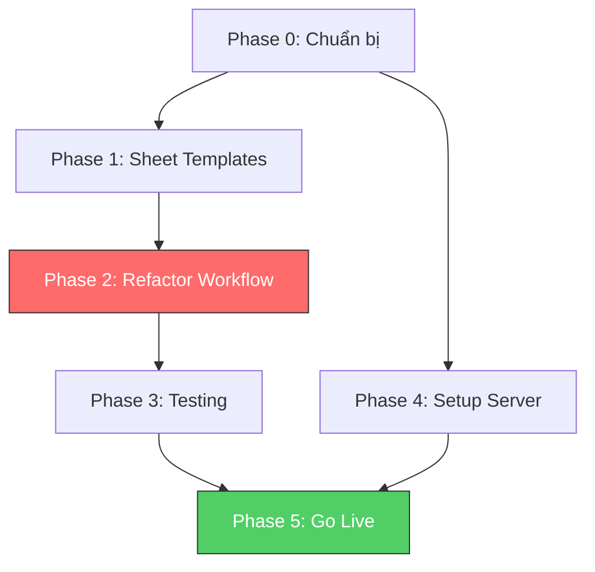

# PLAN: n8n Multi-tenant Workflow

> **Dự án:** Refactor workflow "Bếp nhà" → Master Workflow Multi-tenant
> **Ngày tạo:** 2026-03-16
> **Ước tính:** 2-3 tuần
> **Trạng thái:** 📋 Planning

---

## Tổng quan

Chuyển đổi workflow n8n đơn khách (hardcode credentials) sang kiến trúc **1 Master Workflow + Google Sheet Config** phục vụ nhiều khách hàng trên 1 server.

### Mục tiêu
- ✅ 1 workflow duy nhất phục vụ N khách
- ✅ Thêm khách mới = thêm 1 dòng vào Sheet Admin
- ✅ Credentials động (FB token, Zalo token, Sheet ID)
- ✅ Error handling per customer (1 khách lỗi không ảnh hưởng khách khác)
- ✅ Production-ready trên VPS với Docker

### Kiến trúc đã chốt
```
                    ┌─────────────────────────────┐
                    │   n8n Server (1 instance)    │
                    │                              │
                    │   1 MASTER WORKFLOW DUY NHẤT │
                    │   Schedule → Config → Loop   │
                    └──────────┬──────────────────┘
                               │
                 ┌─────────────┼─────────────┐
                 ▼             ▼             ▼
          ┌──────────┐  ┌──────────┐  ┌──────────┐
          │ Sheet     │  │ Sheet     │  │ Sheet     │
          │ Admin     │  │ Khách A   │  │ Khách B   │
          │ (Config)  │  │ (Video +  │  │ (Video +  │
          │           │  │  Shopee)  │  │  Shopee)  │
          └──────────┘  └──────────┘  └──────────┘
```

---

## Phase 0: Chuẩn bị & Kiểm tra

> ⏱️ Ước tính: 0.5 ngày
> 📌 Mục tiêu: Đảm bảo workflow gốc hoạt động, có baseline để refactor

### Task 0.1: Kiểm tra workflow gốc
- [ ] Chạy workflow gốc "Bếp nhà" trên local → xác nhận hoạt động OK
- [ ] Export workflow JSON mới nhất (backup)
- [ ] Ghi lại danh sách nodes + thứ tự kết nối
- [ ] Xác nhận credentials hiện tại còn valid (FB token, Google Sheets, Zalo)

### Task 0.2: Chuẩn bị môi trường dev
- [ ] Đảm bảo Node.js >= 22.16 (`nvm use 22`)
- [ ] Chạy `npx -y n8n@latest` thành công
- [ ] Backup file `~/.n8n/` (SQLite data)

### Verification
- ✅ Workflow gốc chạy thành công ít nhất 1 lần (upload video → comment → Zalo notify)
- ✅ File `workflow-import.json` đã backup

---

## Phase 1: Google Sheet Templates

> ⏱️ Ước tính: 1 ngày
> 📌 Mục tiêu: Tạo Sheet Admin + Sheet Khách template chuẩn
> 📎 Tham khảo: [05-google-sheet-template.md](./05-google-sheet-template.md)

### Task 1.1: Tạo Google Sheet Admin
- [ ] Tạo Google Sheet mới: "n8n Admin Config"
- [ ] Tạo Tab "Config" với cấu trúc cột:

| Cột | Tên | Kiểu | Bắt buộc |
|-----|-----|------|----------|
| A | `ten_khach` | Text | ✅ |
| B | `facebook_token` | Text | ✅ |
| C | `page_id` | Text | ❌ |
| D | `sheet_id` | Text | ✅ |
| E | `sheet_tab_video` | Text | ❌ |
| F | `sheet_tab_shopee` | Text | ❌ |
| G | `zalo_token` | Text | ✅ |
| H | `chat_id` | Text | ✅ |
| I | `interval_hours` | Number | ✅ |
| J | `status` | Text | ✅ |
| K | `token_expiry` | Date | ❌ |
| L | `last_run` | DateTime | ❌ |
| M | `total_videos` | Number | ❌ |
| N | `ghi_chu` | Text | ❌ |

- [ ] Thêm dòng dữ liệu mẫu (khách "Bếp nhà rơm" hiện tại)
- [ ] Protect Sheet (chỉ admin edit)

### Task 1.2: Tạo Google Sheet Khách Template
- [ ] Tạo Sheet template: "[Template] Bếp nhà Tool"
- [ ] Tab "Video TikTok": `Video Tiktok | Video Facebook | Trạng thái | Thời gian`
- [ ] Tab "Link Shopee": `Tên sản phẩm | Link`
- [ ] Data Validation cho cột Trạng thái (dropdown: thành công / lỗi)
- [ ] Conditional formatting (xanh = thành công, đỏ = lỗi)
- [ ] Header freeze (row 1)

### Task 1.3: Migrate dữ liệu khách hiện tại
- [ ] Copy dữ liệu video từ Sheet gốc sang Sheet Khách mới (format mới)
- [ ] Copy link Shopee sang tab mới
- [ ] Cập nhật Sheet Admin Config với thông tin khách "Bếp nhà rơm"

### Verification
- ✅ Sheet Admin có ít nhất 1 dòng config hợp lệ
- ✅ Sheet Khách template có 2 tab đúng format
- ✅ Phân quyền đúng (admin = owner, khách = editor trên sheet của họ)

---

## Phase 2: Refactor Master Workflow

> ⏱️ Ước tính: 3-5 ngày ⚡ Phase quan trọng nhất
> 📌 Mục tiêu: Refactor workflow gốc thành Master Workflow multi-tenant
> 📎 Tham khảo: [02-architecture.md](./02-architecture.md)

### Task 2.1: Thêm Config Reader + Customer Loop
- [ ] Thêm node **Google Sheets** (đọc Sheet Admin → Tab "Config")
- [ ] Thêm node **Filter** (chỉ lấy khách có `status = "active"`)
- [ ] Thêm node **SplitInBatches** (loop từng khách)
- [ ] Set biến cho mỗi khách: `facebook_token`, `sheet_id`, `zalo_token`, `chat_id`

```
[Schedule Trigger] → [Đọc Config] → [Filter active] → [Loop khách]
                                                            │
                                                            ▼
                                                    [Xử lý video cho khách]
```

### Task 2.2: Migrate Facebook Graph API → HTTP Request
- [ ] **Upload Session**: Thay `facebookGraphApi` node → `httpRequest`
  - URL: `https://graph.facebook.com/v23.0/me/video_reels`
  - Header: `Authorization: Bearer {{ $json.facebook_token }}`
  - Method: POST
  - Body: `{ "upload_phase": "start" }`
- [ ] **Upload Video**: Giữ nguyên (đã là httpRequest)
- [ ] **Publish**: Thay → `httpRequest`
  - URL: `https://graph.facebook.com/v23.0/me/video_reels`
  - Header: `Authorization: Bearer {{ $json.facebook_token }}`
  - Body: `{ "upload_phase": "finish", "video_state": "PUBLISHED", "description": "..." }`
- [ ] **Get Status**: Thay → `httpRequest`
  - URL: `https://graph.facebook.com/v23.0/{{ video_id }}`
- [ ] **Comment**: Thay → `httpRequest`
  - URL: `https://graph.facebook.com/v23.0/{{ video_id }}/comments`

### Task 2.3: Dynamic Google Sheets
- [ ] **Get List Video**: Thay document ID hardcode → expression:
  ```
  Document ID: {{ $('Loop khách').item.json.sheet_id }}
  Sheet Name: {{ $('Loop khách').item.json.sheet_tab_video || 'Video TikTok' }}
  ```
- [ ] **Update Status**: Cùng logic dynamic Sheet ID
- [ ] **Get Link Shopee**: Dynamic Sheet ID + tab name
  ```
  Sheet Name: {{ $('Loop khách').item.json.sheet_tab_shopee || 'Link Shopee' }}
  ```

### Task 2.4: Dynamic Zalo Bot
- [ ] **Send message (success)**: Thay token + chat_id cố định → dynamic:
  ```
  URL: https://bot-api.zapps.me/bot{{ $('Loop khách').item.json.zalo_token }}/sendMessage
  Body: { "chat_id": "{{ $('Loop khách').item.json.chat_id }}", "message": "..." }
  ```
- [ ] **Send Error**: Cùng logic dynamic

### Task 2.5: Error Handling per Customer
- [ ] Wrap flow xử lý video trong **Error Trigger** node
- [ ] Nếu lỗi ở khách X → log lỗi + gửi Zalo lỗi → tiếp tục khách tiếp theo
- [ ] Cập nhật Sheet Khách: cột Trạng thái = "lỗi" + ghi chú lỗi

### Task 2.6: Rate Limiting & Optimization
- [ ] Thêm node **Wait** 5 phút giữa mỗi khách (tránh rate limit)
- [ ] Giới hạn 1 video/khách/lần chạy (node Limit)
- [ ] Cập nhật `last_run` trong Sheet Admin sau khi xử lý xong mỗi khách
- [ ] Cập nhật `total_videos` counter

### Task 2.7: Token Expiry Check
- [ ] Thêm sub-flow kiểm tra `token_expiry`:
  - Nếu token sắp hết hạn (< 7 ngày) → gửi Zalo nhắc nhở
  - Nếu token đã hết hạn → skip khách + gửi alert

### Verification
- ✅ Workflow chạy thành công với khách "Bếp nhà rơm" (dữ liệu thật)
- ✅ Token, Sheet ID, Zalo đều lấy từ Config Sheet (không hardcode)
- ✅ Thêm khách test thứ 2 (fake) → workflow skip nếu token invalid
- ✅ Error handling: simulate lỗi ở khách 1 → khách 2 vẫn chạy OK

---

## Phase 3: Testing

> ⏱️ Ước tính: 2 ngày
> 📌 Mục tiêu: Test toàn diện trước khi lên production

### Task 3.1: Test Happy Path
- [ ] Thêm khách test thứ 2 vào Config (nếu có FB Page thứ 2)
- [ ] Chạy workflow → cả 2 khách đều xử lý OK
- [ ] Kiểm tra Sheet Khách cập nhật đúng
- [ ] Kiểm tra Zalo nhận thông báo đúng khách

### Task 3.2: Test Error Scenarios
- [ ] Test: Token Facebook sai → khách đó skip, khách khác vẫn chạy
- [ ] Test: Sheet ID sai → error handling đúng
- [ ] Test: Video TikTok link sai → lỗi ghi nhận đúng
- [ ] Test: Không có video mới → workflow skip khách
- [ ] Test: Khách `status = "paused"` → bị filter ra

### Task 3.3: Test Edge Cases
- [ ] Test: Tất cả video đã "thành công" → workflow kết thúc sạch
- [ ] Test: Tab Link Shopee trống → không comment (không lỗi)
- [ ] Test: 5+ khách cùng lúc → rate limiting hoạt động

### Verification
- ✅ 0 lỗi không mong muốn sau 5 lần chạy liên tiếp
- ✅ Error scenarios đều có log + thông báo phù hợp

---

## Phase 4: Setup Production Server

> ⏱️ Ước tính: 1-2 ngày
> 📌 Mục tiêu: VPS + Docker + n8n production-ready
> 📎 Tham khảo: [03-server-setup.md](./03-server-setup.md)

### Task 4.1: Thuê VPS
- [ ] Chọn VPS provider (Contabo / Vultr / DigitalOcean)
- [ ] Spec: 2GB RAM, 2 vCPU, 40GB SSD (đủ cho 20 khách)
- [ ] Ubuntu 22.04 LTS
- [ ] Setup SSH key + firewall (UFW: 22, 80, 443)
 
### Task 4.2: Setup Docker + n8n
- [ ] Cài Docker + Docker Compose
- [ ] Tạo `/opt/n8n/docker-compose.yml` (n8n + PostgreSQL)
- [ ] Tạo `/opt/n8n/.env` (DOMAIN, DB_PASSWORD, ENCRYPTION_KEY)
- [ ] `docker compose up -d` → verify n8n chạy

### Task 4.3: Domain + SSL
- [ ] Trỏ domain/subdomain về VPS IP (A record)
- [ ] Cài Nginx + config reverse proxy
- [ ] Certbot SSL (Let's Encrypt)
- [ ] Verify: `https://n8n.yourdomain.com` accessible

### Task 4.4: Backup & Monitoring
- [ ] Tạo script backup PostgreSQL (cron 3h sáng hàng ngày)
- [ ] Setup uptime monitoring (UptimeRobot miễn phí)
- [ ] Test restore từ backup

### Verification
- ✅ n8n accessible qua HTTPS
- ✅ Backup script chạy + restore OK
- ✅ n8n restart tự động sau reboot (`restart: always`)

---

## Phase 5: Go Live & Onboarding

> ⏱️ Ước tính: Ongoing
> 📌 Mục tiêu: Import workflow + onboard khách hàng đầu tiên
> 📎 Tham khảo: [04-customer-onboarding.md](./04-customer-onboarding.md)

### Task 5.1: Deploy Workflow
- [ ] Import Master Workflow JSON vào production n8n
- [ ] Setup Google Sheets credential (OAuth2 / Service Account)
- [ ] Test workflow trên production với khách "Bếp nhà rơm"
- [ ] Bật Schedule Trigger

### Task 5.2: Onboard 5-10 khách đầu tiên
- [ ] Tạo Google Form thu thập thông tin khách
- [ ] Mỗi khách mới: Copy Sheet template → Share → Thêm vào Config
- [ ] Test từng khách trước khi bật auto
- [ ] Gửi tin nhắn bàn giao (template trong doc 04)

### Task 5.3: Monitoring & Support
- [ ] Kiểm tra logs hàng ngày (tuần đầu)
- [ ] Theo dõi token expiry
- [ ] Xử lý lỗi phát sinh
- [ ] Thu thập feedback khách

### Verification
- ✅ 5+ khách hoạt động liên tục 1 tuần không lỗi
- ✅ Tất cả thông báo Zalo gửi đúng

---

## Dependency Graph



> ⚡ **Phase 4 (Server)** có thể làm **song song** với Phase 1+2 để tiết kiệm thời gian.

---

## Rủi ro & Mitigation

| # | Rủi ro | Xác suất | Ảnh hưởng | Giải pháp |
|---|--------|----------|-----------|-----------|
| 1 | FB Graph API node không hỗ trợ dynamic credential | Cao | Cao | Chuyển sang HTTP Request (đã chốt) |
| 2 | Google Sheets node không hỗ trợ dynamic Sheet ID | Trung bình | Cao | Test trước, fallback = HTTP Request + Sheets API |
| 3 | TikWM API ngừng hoạt động | Trung bình | Cao | Backup: SnapTik API, yt-dlp self-host |
| 4 | FB Token hết hạn (60 ngày) | Cao | Trung bình | Dùng permanent token (System User) |
| 5 | Rate limit Facebook | Trung bình | Trung bình | Spacing 5 phút/khách, 1 video/lần |
| 6 | 1 khách lỗi → block loop | Cao | Cao | Error Trigger + try/catch per customer |

---

## Timeline ước tính

| Tuần | Phase | Deliverable |
|------|-------|-------------|
| **Tuần 1** | Phase 0 + 1 + bắt đầu Phase 2 | Sheet templates + bắt đầu refactor |
| **Tuần 2** | Phase 2 (tiếp) + Phase 3 | Master Workflow hoàn chỉnh + test |
| **Tuần 2-3** | Phase 4 (song song) | Production server ready |
| **Tuần 3** | Phase 5 | Go live + onboard 5 khách đầu |

---

## Tài liệu tham khảo

- [01-workflow-overview.md](./01-workflow-overview.md) — Workflow gốc
- [02-architecture.md](./02-architecture.md) — Kiến trúc multi-tenant
- [03-server-setup.md](./03-server-setup.md) — Setup server
- [04-customer-onboarding.md](./04-customer-onboarding.md) — Onboard khách
- [05-google-sheet-template.md](./05-google-sheet-template.md) — Sheet templates
- [06-business-model.md](./06-business-model.md) — Mô hình kinh doanh
